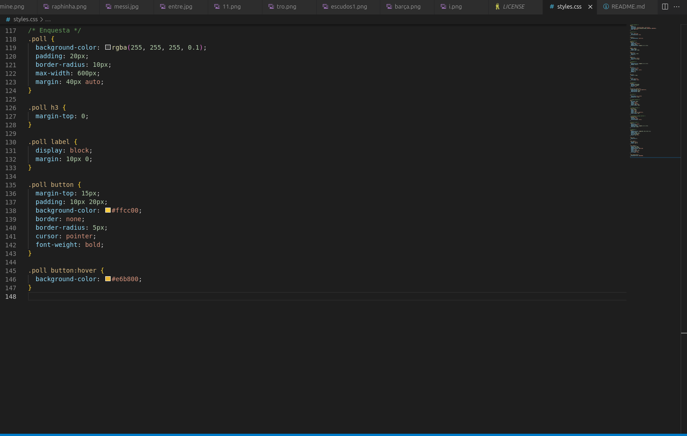

# Creación y Configuración del Repositorio para mi Página Web

En este proyecto, he creado una página web dedicada al Fútbol Club Barcelona. Para organizar el código y los recursos, primero configuré un repositorio en GitHub y luego trabajé localmente en mi ordenador.

Tuve que crear un repositorio en GitHub, luego copiar la URL SSH para usarla en la terminal y clonar el repositorio con el comando `git clone` seguido del enlace correspondiente. Después, abrí Visual Studio Code para comenzar a trabajar en mi página web.

Creé los archivos `index.html` y `styles.css`, además de una carpeta para almacenar las imágenes relacionadas con el contenido de la página, que trata sobre el Fútbol Club Barcelona.

Entre las imágenes que incluí, y que están organizadas para coincidir con la estructura del HTML y CSS, se encuentran:

---

## Desarrollo del archivo `index.html`

Primero empecé con el `index.html` y ahora mostraré las imágenes del proceso en orden:

  
  
  
  
  
  

---

## Desarrollo del archivo `styles.css`

A continuación, continué con el `styles.css`, que sirve para darle el aspecto visual a la web:

  
  
  
  

---

## Imágenes utilizadas en la página

Después descargué imágenes y las coloqué en la carpeta que creé previamente, llamada `imagenes`. Estas imágenes son sobre entrenamientos, trofeos, celebraciones y escudos del club:

  
  
  
  
  
  
  
  
  

